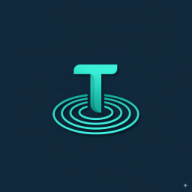

<div align="center">
  
  <h1>TalentPool</h1>
  <h3>Professional Hiring Platform</h3>
  <p><em>Connecting talent with opportunity</em></p>
  <br>
  <p><strong>© 2025 Paristat — TalentPool</strong></p>
</div>

---

# TalentPool - Hiring Platform

A modern, full-stack hiring platform built with React, TypeScript, and Supabase. TalentPool connects talented professionals with innovative companies, providing a seamless experience for both job seekers and recruiters.

## 🚀 Features

### For Job Seekers
- **Browse Jobs**: Discover opportunities from various companies
- **Job Applications**: Apply to positions with a streamlined process
- **Profile Management**: Create and maintain professional profiles
- **Application Tracking**: Monitor your application status
- **Responsive Design**: Works seamlessly on desktop and mobile devices

### For Recruiters
- **Job Posting**: Create and manage job listings
- **Candidate Management**: Review and manage applications
- **Dashboard Analytics**: Track hiring metrics and performance
- **Profile Viewing**: Access detailed candidate profiles
- **Application Management**: Streamline the hiring process

### General Features
- **Authentication**: Secure user registration and login
- **Role-based Access**: Separate dashboards for candidates and recruiters
- **Dark/Light Theme**: Toggle between themes for better user experience
- **Mobile Support**: Native mobile app support via Capacitor
- **Real-time Updates**: Live data synchronization with Supabase

## 🛠️ Tech Stack

- **Frontend**: React 19, TypeScript, Vite
- **Styling**: Tailwind CSS
- **Backend**: Supabase (PostgreSQL, Auth, Real-time)
- **Mobile**: Capacitor (iOS & Android)
- **Routing**: React Router DOM
- **State Management**: React Context API

## 📱 Mobile Support

TalentPool includes native mobile app support for both iOS and Android platforms using Capacitor.

## 🚀 Getting Started

### Prerequisites
- Node.js (v18 or higher)
- npm or yarn
- Supabase account

### Installation

1. **Clone the repository**
   ```bash
   git clone <repository-url>
   cd talentpool-hiring-platform
   ```

2. **Install dependencies**
   ```bash
   npm install
   ```

3. **Set up Supabase**
   - Create a new project in [Supabase](https://supabase.com)
   - Copy your project URL and anon key
   - Update the Supabase configuration in `supabase.ts`

4. **Run the development server**
   ```bash
   npm run dev
   ```

5. **Open your browser**
   Navigate to `http://localhost:5173`

## 📱 Mobile Development

### Android Development
```bash
npm run mobile:android
```

### iOS Development
```bash
npm run mobile:ios
```

### Sync Mobile Assets
```bash
npm run mobile:sync
```

## 🚀 Deployment

### Deploy to Supabase
```bash
npm run deploy
```

### Build for Production
```bash
npm run build
```

## 📁 Project Structure

```
├── components/          # Reusable UI components
├── pages/              # Application pages/routes
├── auth/               # Authentication logic
├── contexts/           # React contexts (Theme, etc.)
├── hooks/              # Custom React hooks
├── data/               # Mock data and utilities
├── supabase/           # Supabase configuration
├── android/            # Android native code
├── ios/                # iOS native code
└── public/             # Static assets
```

## 🔧 Available Scripts

- `npm run dev` - Start development server
- `npm run build` - Build for production
- `npm run preview` - Preview production build
- `npm run deploy` - Deploy to Supabase
- `npm run mobile:build` - Build for mobile
- `npm run mobile:android` - Open Android Studio
- `npm run mobile:ios` - Open Xcode
- `npm run mobile:sync` - Sync mobile assets

## 🤝 Contributing

1. Fork the repository
2. Create a feature branch (`git checkout -b feature/amazing-feature`)
3. Commit your changes (`git commit -m 'Add some amazing feature'`)
4. Push to the branch (`git push origin feature/amazing-feature`)
5. Open a Pull Request

## 📄 License

This project is licensed under the MIT License - see the [LICENSE](LICENSE) file for details.

## 🆘 Support

If you have any questions or need help, please open an issue in the repository or contact the development team.

---

Built with ❤️ for connecting talent with opportunity.